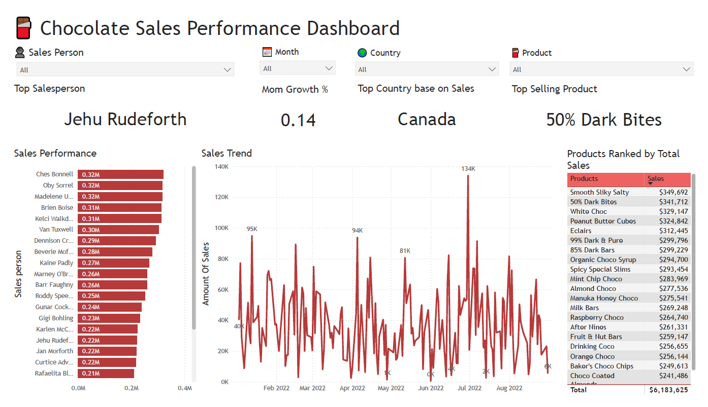

# 🍫 Chocolate Sales Performance & ETL Pipeline (PostgreSQL + Power BI)

## 📘 Project Overview
This project analyzes the **sales performance of a chocolate company** using a complete **ETL pipeline built in PostgreSQL** and visualized with **Power BI**.  
The project simulates a real-world analytics workflow where raw transactional data from a database is cleaned, validated, and transformed into actionable business insights.

The company aims to:
1. 📈 Understand overall **sales performance** by product, region, and salesperson  
2. 🧹 Build a **robust SQL-based ETL pipeline** for automated data cleaning  
3. 📊 Create an interactive **Power BI dashboard** to help executives monitor trends and identify top-performing products

---

## 🎯 Objective
Develop a **SQL-driven ETL process** and a **Power BI dashboard** to:
- Clean and validate raw sales data directly in PostgreSQL  
- Analyze sales trends and top-performing products  
- Provide insights for data-driven business decisions  

---

## ❓ Business Questions

### 💰 Sales Performance
- Which **products generate the highest revenue**?  
- Who are the **top-performing salespeople**?  
- What are the **sales trends over time (Jan–Aug 2022)**?  
- Which **countries contribute the most** to total sales?

### 📦 Operational Efficiency
- Are there any **data anomalies or invalid transactions** (negative or missing values)?  
- How can we **detect and remove outliers** to ensure accurate reporting?  
- Is the dataset ready for seamless connection to BI tools?

---

## ⚙️ ETL Workflow (PostgreSQL)

The entire ETL pipeline is written in pure **SQL**, following these stages:

| Step | Description |
|------|--------------|
| **Extract** | Retrieve raw sales data from `chocolate_sales` table |
| **Transform** | Convert `"Amount"` from text → numeric, parse `"Date"` from text → date, clean nulls |
| **Validate** | Run data profiling function to check null %, unique values, duplicates |
| **Outlier Detection** | Identify and review extreme transaction values |
| **Load** | Create final clean view `chocolate_sales_clean` for BI tools |

Main SQL file: [`ChocolateSalesCleaning.sql`](ChocolateSalesCleaning.sql)

---

## 📊 Dashboard Preview

### 🧱 **Sales Overview Dashboard**
Visualized in **Power BI**, connected directly to the cleaned PostgreSQL view.  
Includes slicers for **Salesperson, Country, Month, and Product**.

### 📈 Dashboard Components
| Section | Description |
|----------|--------------|
| **Top Salesperson** | Displays the best-performing sales agent by total revenue |
| **Sales Trend** | Line chart showing sales progression from Jan–Aug 2022 |
| **Sales Performance** | Ranked bar chart of all salespeople |
| **Top Country** | Highlights the region with highest total sales |
| **Best-Selling Product** | Table & card view for top products by revenue |
| **Product Trend** | Treemap visualizing product contribution by sales amount |

---

## 📈 Key Insights

- 🥇 **Top Salesperson:** Jehu Rudeforth — consistently leading sales across multiple months.  
- 🍫 **Best-Selling Product:** *50% Dark Bites*, followed closely by *Smooth Silky Salty* and *White Choc*.  
- 🌍 **Top Country:** Canada generated the highest total revenue.  
- 📊 **Monthly Growth (MoM):** Overall sales grew by **14%** month-over-month during early 2022.  
- 🧹 **Data Cleaning Impact:** All text, date, and currency fields successfully standardized for BI usage.

---

## 💡 Recommendations

1. **Reward High Performers** — Incentivize top salespeople to maintain momentum.  
2. **Expand Best-Selling Lines** — Focus marketing on high-performing SKUs like *50% Dark Bites*.  
3. **Monitor Slow-Moving Products** — Identify and optimize low-contribution SKUs.  
4. **Automate Data Updates** — Schedule PostgreSQL → Power BI refresh for daily sales visibility.  
5. **Establish Data Quality Checks** — Maintain validation functions to prevent nulls or incorrect data types.

---

## 🧰 Tools & Techniques

| Tool | Usage |
|------|--------|
| **PostgreSQL 16** | Data storage, cleaning, and transformation |
| **pgAdmin 4** | SQL development environment |
| **Power BI** | Data modeling, DAX measures, and interactive visualization |
| **DAX** | Used to calculate Month-over-Month (MoM) growth |
| **SQL Functions** | Custom data profiling and outlier detection |

---

## 📊 Dataset Information

Dataset: [Chocolate Sales Dataset (Kaggle)](https://www.kaggle.com/datasets/atharvasoundankar/chocolate-sales)  
- Contains sales records including salesperson, product, country, amount, and shipment data.  
- Covers transactions between **January–August 2022**.  
- Used for educational and portfolio purposes only.

---

## 📂 Files in this Repository

| File | Description |
|------|--------------|
| `ChocolateSalesCleaning.sql` | Full ETL SQL pipeline (Extract, Transform, Load) |
| `DashboardPicture.png` | Power BI dashboard preview |
| `chocolate_sales.csv` | Original dataset from Kaggle |
| `README.md` | Project documentation |

---

## ✍️ Author
**James**  
🎓 Computer Science Student — *Tarumanagara University (Indonesia)*  
📊 Data Analysis & Visualization Enthusiast  
📍 Jakarta, Indonesia
