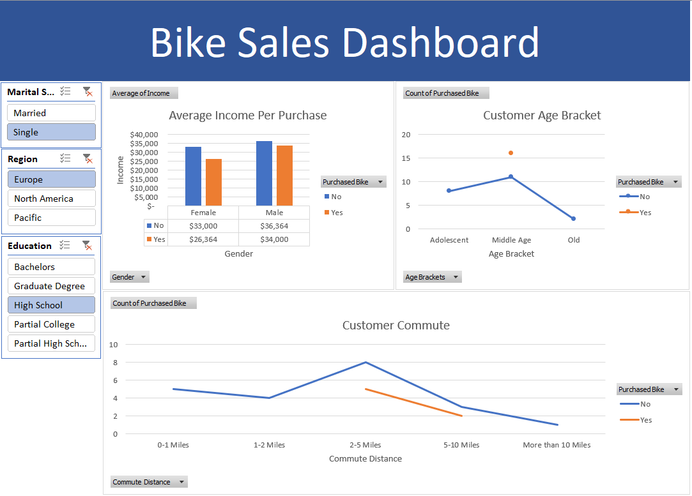

# 🚴‍♂️ Bike Sales Dashboard (Excel Project)

## 📘 Project Overview
This project visualizes **bike purchase data** to understand how customer demographics and lifestyle factors  
influence their decision to buy a bike.  

The dashboard was built using **Microsoft Excel**, leveraging **Pivot Tables**, **Pivot Charts**, and **Slicers**  
to create an **interactive and dynamic business report** for sales insights.

---

## 🎯 Objectives
- Analyze customer demographics that affect bike purchases  
- Identify which income groups are more likely to buy bikes  
- Understand customer distribution based on **age, education, and commute distance**  
- Build an interactive Excel dashboard with filters for better data exploration  

---

## 📊 Dashboard Preview

🔹 The dashboard includes slicers for:
- Marital Status  
- Region  
- Education  

📊 Key visual components:
1. **Average Income per Purchase** – compares average income between buyers and non-buyers by gender  
2. **Customer Age Bracket** – shows purchase trends across different age groups  
3. **Customer Commute** – analyzes bike purchase likelihood by daily commute distance  

---

## 💾 Dataset
📚 **Dataset Name:** Bike Buyers Dataset  
📄 **Source:** [Alex The Analyst – Excel Bike Buyers Dataset](https://github.com/AlexTheAnalyst/Excel-Tutorial/blob/main/Excel%20Project%20Dataset.xlsx)  
👤 **Author:** Alexander Freberg (*Alex The Analyst*)  
📊 **Data Fields:**
- Gender, Marital Status, Education, Region  
- Income and Commute Distance  
- Purchase Decision (Yes/No)

---

## 🧠 Key Insights
- 💰 **Higher-income customers** are more likely to buy bikes.  
- 👨‍🦱 **Middle-aged customers** show the highest likelihood of purchasing.  
- 🚴‍♀️ Customers with **shorter commutes (1–5 miles)** are more inclined to buy bikes.  
- 🎓 Education and marital status have minor influence compared to income and distance.  

---

## 🧰 Tools & Techniques Used
- **Microsoft Excel**  
  - Pivot Tables & Pivot Charts  
  - Slicers for interactivity  
  - Conditional Formatting  
  - Basic Data Cleaning  

---

## 📎 Access the File
📂 **Excel Portfolio Folder (View Only):**  
[Open on Google Drive](https://drive.google.com/drive/folders/1g50puUpQnYvy0KwOqF4xD3S6_JTkMGHt?usp=drive_link)

---

## 📈 Project Outcome
- Built an interactive sales dashboard from raw customer data  
- Demonstrated ability to design Excel reports for business decision-making  
- Highlighted patterns in demographic behavior using Excel’s analytics features  

---

## ✍️ Author
**James**  
🎓 Tarumanagara University — Computer Science  
📍 Jakarta, Indonesia  
📊 Data Analysis & Visualization Enthusiast  