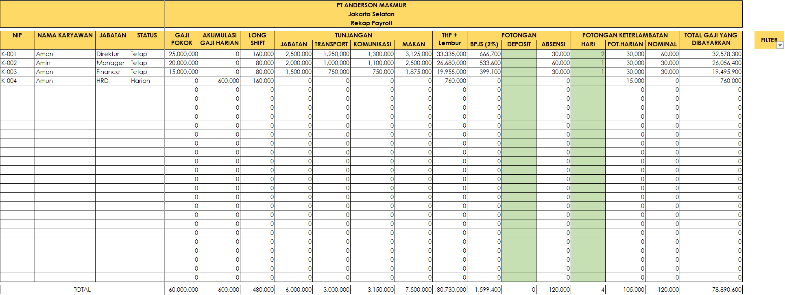

# 🧾 Payroll Automation System (Excel Project)

## 📘 Project Overview
This project automates the **payroll calculation process** using **Microsoft Excel**.  
It was designed to handle employee salary computation based on attendance, job position,  
overtime, and allowances — all integrated into one workbook.

The goal of this project is to practice **data structuring, formula logic, and automation**  
in Excel, creating a simple yet functional payroll system for a fictional company:  
**PT Anderson Makmur**, located in Jakarta Selatan.

---

## 🎯 Objectives
- Automate payroll calculation using Excel formulas  
- Centralize employee data, attendance, and job details into connected sheets  
- Calculate salary, overtime, and deductions automatically  
- Generate summarized reports and printable payslips  
- Build a practical example of business process automation using Excel  

---

## 📊 Dashboard Preview

---

## 💾 Workbook Structure
The Excel file contains multiple interconnected sheets, each serving a specific function:

| Sheet Name | Function |
|-------------|-----------|
| **PROFILE** | Basic company information (e.g., name, location, logo) |
| **DBKARYAWAN** | Employee master data (NIP, Name, Position, Status) |
| **JABATAN** | Job position and base salary reference |
| **ABSENSI** | Employee attendance records (absent days, overtime, etc.) |
| **PAYROLL** | Main calculation sheet — combines all components (salary, bonus, deductions) |
| **GAJI** | Recap of monthly salary payments |
| **SLIPGAJI** | Printable payslip per employee |

---

## ⚙️ Formula Logic
Key Excel formulas used in this project:
- `IF()` and `AND()` → to differentiate permanent vs daily workers  
- `INDEX()` + `MATCH()` → to fetch allowance values from job reference tables  
- `SUM()` and `VLOOKUP()` → to aggregate salary components  
- `Data Validation` and `Named Ranges` → to manage employee lists and dropdowns  
- Conditional formatting for automatic highlighting  

These formulas allow the workbook to:
- Auto-calculate daily, weekly, and monthly salary  
- Adjust overtime and deductions dynamically  
- Produce clean printable salary reports  

---

## 🧠 Key Features
- ✅ Fully automated payroll calculation  
- 🧾 Integrated data between attendance, job, and employee sheets  
- 💰 Dynamic computation of allowances, overtime, and BPJS (2%) deductions  
- 📈 Real-time total salary updates at the bottom  
- 🖨️ Ready-to-print payslip format  

---

## 🔗 Access the File
📎 **View the Payroll Workbook (Read-Only)**  
[Google Drive Link](https://drive.google.com/drive/folders/1g50puUpQnYvy0KwOqF4xD3S6_JTkMGHt?usp=drive_link)  

---

## 🧰 Tools & Techniques Used
- **Microsoft Excel**  
  - Advanced formulas (IF, INDEX-MATCH, VLOOKUP)  
  - Conditional formatting  
  - Data validation and dropdowns  
  - Worksheet linking and named ranges  

---

## 📈 Project Outcome
- Reduced manual calculation errors by automating key payroll components  
- Improved data accuracy and transparency for employee salary records  
- Demonstrated ability to combine **business understanding with Excel logic**

---

## ✍️ Author
**James**  
🎓 Tarumanagara University — Computer Science  
📍 Jakarta, Indonesia  
📊 Data Analysis & Visualization Enthusiast  
