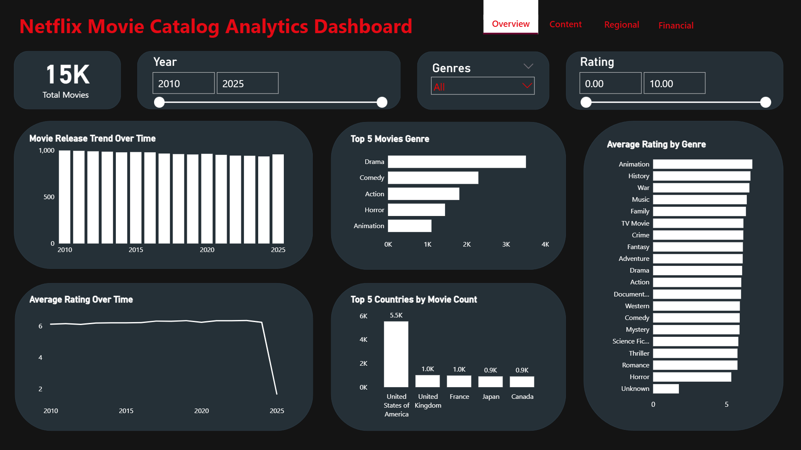
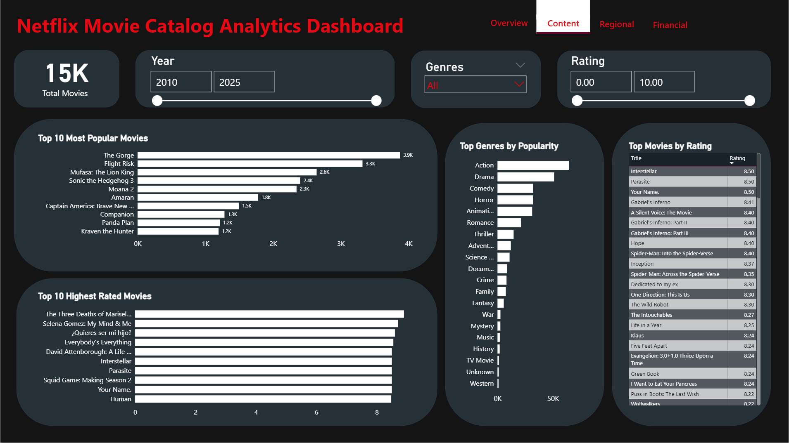
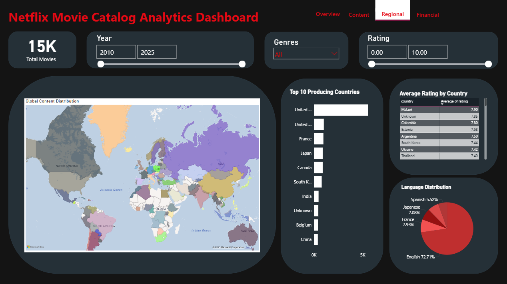
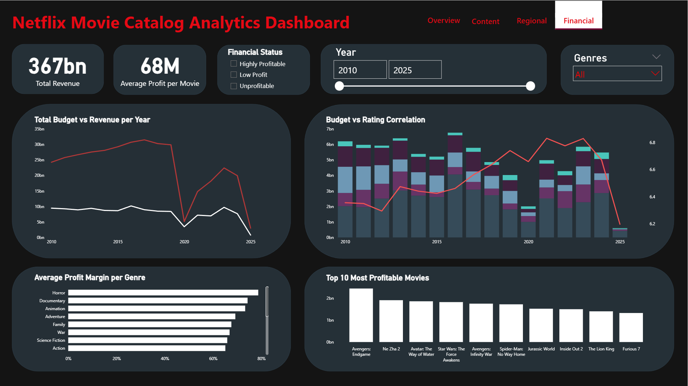

# 🎬 Netflix Movie Catalog Analytics Dashboard  

This project explores and visualizes Netflix’s movie catalog data to uncover content trends, audience preferences, and financial insights from 2010–2025. Using Python for data analysis and Power BI for interactive dashboards, the goal is to understand how genres, ratings, and regional factors influence Netflix’s content strategy and profitability.  

---

## 1. Dataset  

**Source:** [Netflix Movies and TV Shows Till 2025 (Kaggle)](https://www.kaggle.com/datasets/bhargavchirumamilla/netflix-movies-and-tv-shows-till-2025/)  
*A curated dataset of Netflix content sourced from TMDb, including detailed metadata about titles, genres, release years, ratings, and countries of origin.*  

**Key Information:**  
- **Total records:** ~15,000 movies  
- **Main features:** Title, Genre, Release Year, Country, Rating, Popularity, Budget, Revenue, and Profitability  
- **Goal:**  
  - Analyze content distribution and genre trends  
  - Explore rating patterns and regional contributions  
  - Evaluate financial performance across years and genres  

---

## 2. Tools and Libraries  

**Python:**  
- `pandas`, `numpy` — data cleaning and manipulation  
- `matplotlib`, `seaborn` — exploratory visualizations  
- `plotly` — interactive data plots  

**Dashboarding Tools:**  
- **Power BI** — interactive dashboards for content, regional, and financial analytics  

---

## 3. Analysis Workflow  

1. **Data Cleaning & Preprocessing**  
   - Removed duplicates and missing values  
   - Standardized date and genre formats  
   - Encoded categorical features and normalized rating scales  

2. **Exploratory Data Analysis (EDA)**  
   - Studied rating distributions and release trends over time  
   - Identified top-performing genres and countries  
   - Detected outliers in ratings and profitability  

3. **Feature Engineering**  
   - Created new metrics: profit margin, rating index, and country-level aggregates  
   - Grouped genres for trend analysis  

4. **Dashboarding & Visualization**  
   - Built multi-page Power BI dashboards (Overview, Content, Regional, Financial)  
   - Added interactive filters for **Year**, **Genre**, and **Rating**  

5. **Evaluation & Insight Extraction**  
   - Interpreted dashboard outputs to identify strategic insights  
   - Summarized correlations between budget, rating, and profit  

---

## 4. Visualizations / Dashboards  

### 🔹 Overview Dashboard  
  
**Key Insights:**  
- ~15K movies analyzed (2010–2025)  
- Drama dominates Netflix’s catalog, followed by Comedy and Action  
- U.S. leads production volume, accounting for >35% of total titles  
- Average ratings have declined slightly after 2023  

### 🔹 Content Dashboard  
  
**Key Insights:**  
- Top popular movies include *The Gorge*, *Flight Risk*, and *Mufasa: The Lion King*  
- *Interstellar*, *Parasite*, and *Your Name* are among the highest-rated titles  
- Action and Drama genres dominate user engagement  

### 🔹 Regional Dashboard  
  
**Key Insights:**  
- Major content production hubs: U.S., U.K., France, Japan, and Canada  
- Highest-rated content originates from Malawi, Colombia, and Estonia  
- English dominates (≈72%), followed by French, Japanese, and Spanish  

### 🔹 Financial Dashboard  
  
**Key Insights:**  
- Total Revenue: **$367B**, Average Profit: **$68M per movie**  
- Profitability dips observed post-2023 despite steady budgets  
- Horror and Documentary genres deliver the **highest profit margins**  
- *Avengers: Endgame* remains Netflix’s most profitable movie  

---

## 5. Key Findings & Insights  

- **Genre Trends:** Drama and Action lead in production and popularity, but Horror yields the best profit margins.  
- **Regional Dynamics:** North America and Europe dominate Netflix’s content supply, yet high-rated content also comes from emerging markets.  
- **Financial Patterns:** Increasing budgets don’t always correlate with higher ratings; profitability peaks in mid-2010s.  
- **Audience Behavior:** Average global ratings remain between 6–7, showing consistent viewer satisfaction.  

---

## 6. Conclusion  

This project demonstrates how combining **EDA** and **dashboard analytics** can uncover actionable insights in entertainment data.  
Netflix’s catalog growth reflects a balance between **high-budget global hits** and **niche regional content** that resonates with specific audiences.  
Future strategies could focus on optimizing budget allocations for high-margin genres like Horror and Animation, while promoting diversity in language and regional content.  

---

## 7. Additional Notes  

- **Challenges:** Handling missing and inconsistent metadata from multiple countries.  
- **Future Enhancements:**  
  - Integrate time-series forecasting for release trends  
  - Analyze viewer sentiment using TMDb reviews  
  - Build predictive models for movie profitability  
- **References:**  
  - [TMDb API Documentation](https://developer.themoviedb.org/docs)  
  - [Netflix Kaggle Dataset](https://www.kaggle.com/datasets/bhargavchirumamilla/netflix-movies-and-tv-shows-till-2025/)  

---

## ✍️ Author  

**James**  
🎓 Computer Science Student — *Tarumanagara University (Indonesia)*  
📊 Data Analysis & Visualization Enthusiast  
📍 Jakarta, Indonesia  
