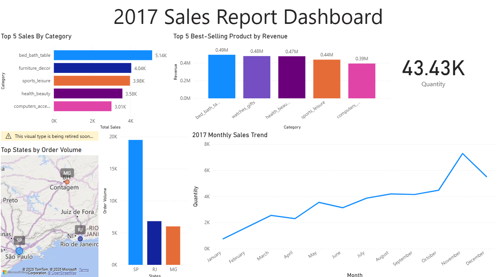
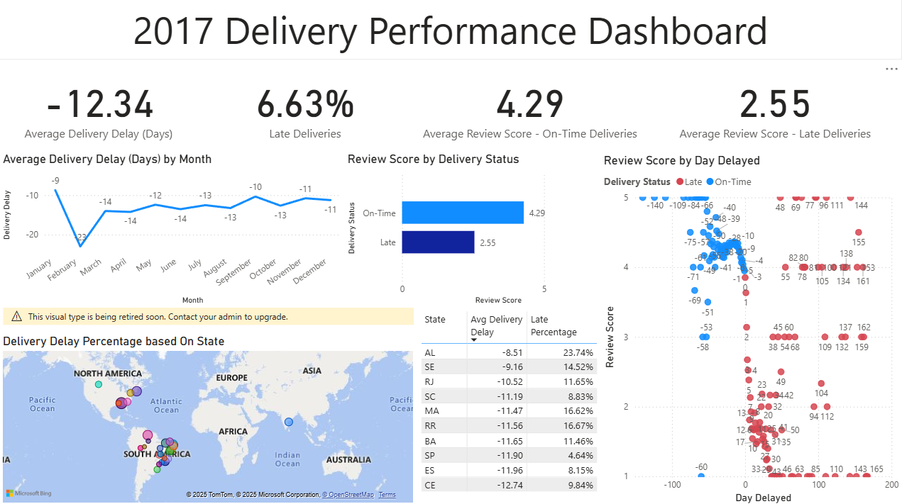
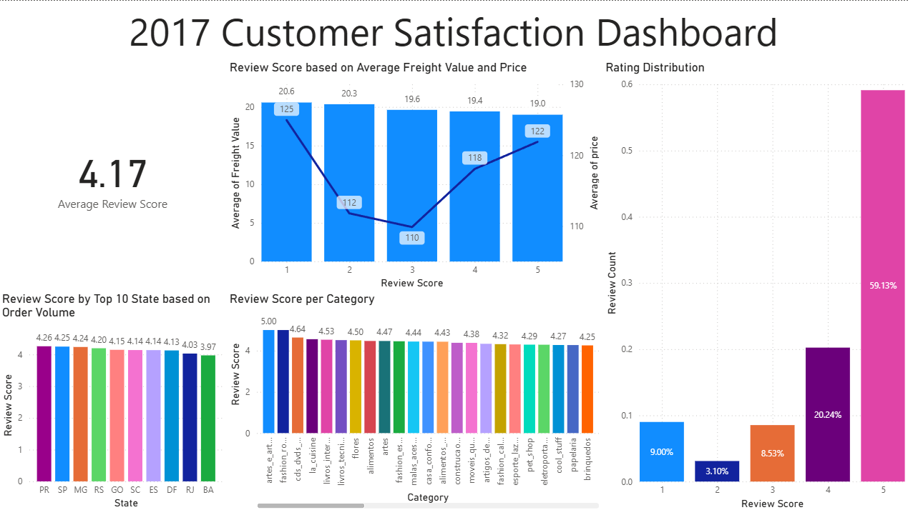
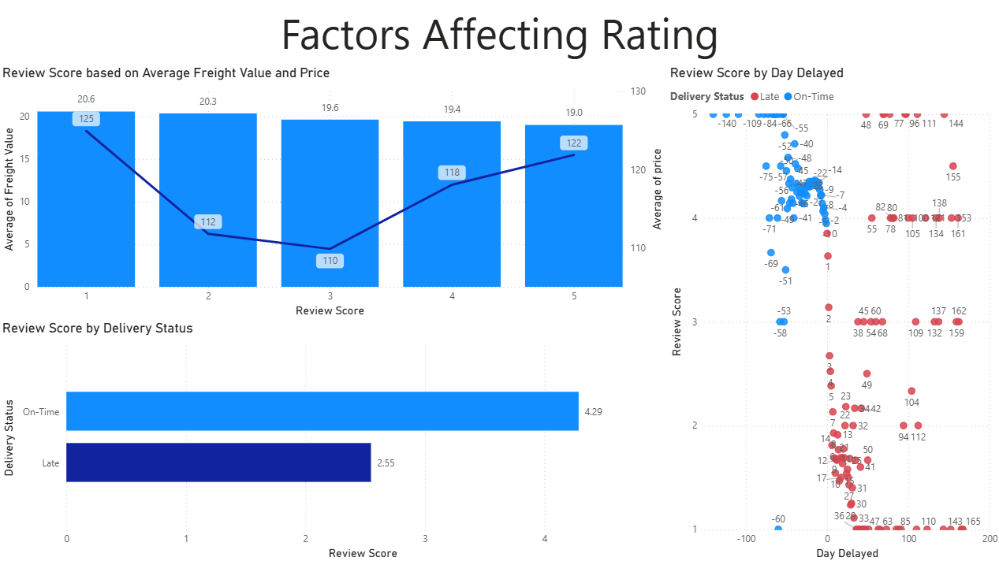
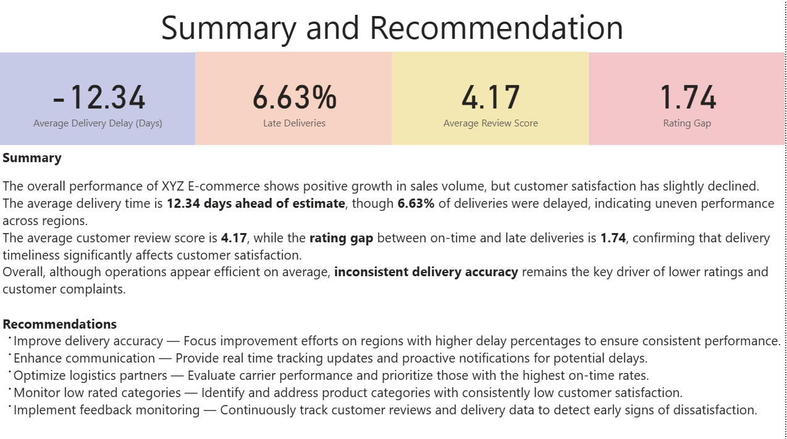

# 📊 E-Commerce Sales & Customer Satisfaction Analysis (Power BI Project)

## 📘 Project Overview
This project uses the **Brazilian E-Commerce Public Dataset by Olist** to simulate a real-world business case for an online retail company (**XYZ E-Commerce**).  
The company has recently experienced two main issues:
1. 📈 Total sales have increased,  
   but ⭐ **customer satisfaction ratings have declined**.  
2. 🚚 There has been an **increase in complaints** related to **late deliveries**.

The goal of this project is to analyze sales and delivery performance data to identify  
the key factors contributing to the decline in customer satisfaction and provide actionable insights  
to improve the overall customer experience.

---

## 🎯 Objective
Analyze **sales performance** and **delivery efficiency** to uncover the root causes behind  
the decline in customer satisfaction and provide actionable insights to improve user experience.

---

## ❓ Business Questions

### 🛒 Sales Performance
- How has the **monthly sales trend** changed over the past year?  
- Which **product categories** are the best sellers?  
- Which categories generate the **highest revenue**?  
- Which **regions** have the highest customer base?

### 🚚 Delivery Performance
- What is the **average delivery time** compared to estimated delivery dates?  
- Which regions experience the **most delivery delays**?  
- What is the **month-to-month delay trend**?  
- What percentage of deliveries were **late**?  
- Does **delivery delay** correlate with **low customer ratings**?

### ⭐ Customer Satisfaction
- What is the **distribution of customer ratings (1–5)**?  
- Do certain **product categories** tend to get lower ratings?  
- What **factors most influence** customer satisfaction?

---

## 📊 Dashboard Preview

### 🛒 Sales Performance Dashboard
Shows total quantity sold, revenue by category, and top-performing states.  

### 🚚 Delivery Performance Dashboard
Highlights average delivery delays, regional delay distribution, and review scores based on delivery timeliness.  

### ⭐ Customer Satisfaction Dashboard
Displays overall average review score, distribution of ratings, and satisfaction by state and category.  

### ⚙️ Factors Affecting Rating
Correlates delivery delay, freight value, and pricing with customer review scores.  

### 📋 Summary and Recommendations
Summarizes main KPIs and provides actionable recommendations to improve operations.  

---

## 📈 Key Insights

- 💰 **Sales increased steadily** across months, especially in top categories like *bed & bath* and *furniture décor*.  
- 📦 **6.63% of deliveries** were delayed, and the **average delay gap** was around **12.34 days** early ahead of estimation, showing **uneven performance** across regions.  
- ⭐ **Average customer review score = 4.17**, but there is a **rating gap of 1.74** between *on-time* (4.29) and *late* deliveries (2.55).  
- 📉 States with higher delay percentages consistently show **lower satisfaction ratings**.  
- 🚀 The analysis confirms that **delivery timeliness is the strongest factor** influencing customer satisfaction decline.

---

## 💡 Recommendations

1. **Improve Delivery Accuracy** — Focus improvement efforts on regions with higher delay percentages.  
2. **Enhance Communication** — Provide real-time tracking updates and proactive delay notifications.  
3. **Optimize Logistics Partners** — Evaluate carrier performance and prioritize reliable ones.  
4. **Monitor Low-Rated Categories** — Identify product groups that consistently receive low reviews.  
5. **Implement Feedback Monitoring** — Track satisfaction data continuously to detect early dissatisfaction signals.

---

## 🧰 Tools & Techniques
- **Power BI** — Data modeling, DAX measures, and visualization  
- **Data Analysis** — Correlation analysis and KPI tracking  
- **Storytelling** — Translating data into actionable business insights

---

## 📊 Dataset Information

The dataset used in this project is the  
**[Brazilian E-Commerce Public Dataset by Olist](https://www.kaggle.com/datasets/olistbr/brazilian-ecommerce)**  
published on [Kaggle](https://www.kaggle.com/) by **Olist and collaborators (Francisco Magioli, Leo Dabagge, Andre Sionek)**.

- This dataset contains order, product, customer, and review information from 2016–2018.  
- It is **real anonymized commercial data**, made publicly available for educational and analytical purposes.  
- License: **CC BY-NC-SA 4.0** (non-commercial use, attribution required)

I used this dataset solely for learning and portfolio purposes —  
to practice data visualization and analysis using Power BI and Excel.

---

## 📂 Files in this Repository
| File | Description |
|------|--------------|
| `Sales_Performance.png` | Sales overview dashboard |
| `Delivery_Performance.png` | Delivery timeliness and delay performance |
| `Customer_Satisfaction.png` | Customer satisfaction and rating distribution |
| `Factors_AffectingRating.png` | Correlation between delivery and rating |
| `Summary.png` | Summary & recommendations view |

---

## ✍️ Author
**James**  
🎓 Computer Science Student — *Tarumanagara University (Indonesia)*  
📊 Passionate about Data Analytics, Business Intelligence, and Storytelling through Data  
📍 Jakarta, Indonesia  
