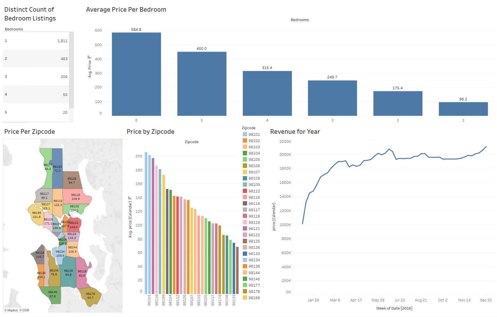

# 📉 Airbnb Market Analysis (Tableau Project)

## 📘 Project Overview
This project analyzes **Airbnb listings data** to understand pricing patterns, revenue trends,  
and property availability across different regions and room types.

The goal is to identify key insights about how **location, bedroom count, and listing price**  
influence the overall **revenue performance** in the Airbnb market.

This analysis uses the **Airbnb 2016 dataset** from Kaggle (by *Alex The Analyst*)  
and was visualized using **Tableau Public**.

---

## 🎯 Objectives
- Analyze average Airbnb prices per bedroom count  
- Compare listing prices across zip codes  
- Explore total revenue trend over the year  
- Identify neighborhoods with the highest and lowest pricing  
- Understand how property size impacts rental revenue  

---

## 📊 Dashboard Preview

🔗 **View Interactive Dashboard on Tableau Public:**  
[Airbnb Market Analysis – Tableau Dashboard](https://public.tableau.com/app/profile/james.anderson1890/viz/AirBnBProject_17610546662080/Dashboard1?publish=yes)

---

## 💾 Dataset Source
📚 **Dataset:** [Airbnb Listings 2016 Dataset](https://www.kaggle.com/datasets/alexanderfreberg/airbnb-listings-2016-dataset)  
👤 **Author:** Alexander Freberg (*Alex The Analyst*)  
📄 **License:** Public dataset for educational use  

**Dataset includes:**
- Listing price and availability  
- Bedroom count and property type  
- Zipcode and location data  
- Historical revenue and booking patterns  

---

## 🧠 Key Insights
- 💰 **6-bedroom properties** have the **highest average price** among all room types.  
- 🏙️ **Zipcode 98101** has the **most expensive listings**, while areas like 98178 and 98199 are more affordable.  
- 📆 **Revenue grows steadily** throughout the year with a peak around **mid-year (May–July)**.  
- 🛏️ **Smaller properties (1–2 bedrooms)** dominate the listings, indicating a high number of short-term rentals.  
- 📍 **Location and bedroom count** remain the strongest drivers of price and total revenue.

---

## 💡 Visualization Focus
- **Average Price per Bedroom** — compares pricing based on property size.  
- **Price by Zipcode** — visualizes price differences across Seattle neighborhoods.  
- **Revenue Trend** — shows total yearly revenue trend.  
- **Geographical Heatmap** — maps average listing prices by area.  

---

## 🧰 Tools Used
- **Tableau Public** — Interactive dashboard visualization  
- **Excel / CSV** — Data preparation and cleaning  
- **Kaggle** — Dataset source and exploration  

---

## 📂 Files in This Folder
| File | Description |
|------|--------------|
| `Dashboard.png` | Screenshot of Tableau dashboard |
| `README.md` | Project documentation |

---

## ✍️ Author
**James**  
🎓 Tarumanagara University — Computer Science  
📍 Jakarta, Indonesia  
📊 Data Visualization & Business Intelligence Enthusiast  

---

### 🏷️ Attribution
Dataset: [Airbnb Listings 2016 by Alex The Analyst](https://www.kaggle.com/datasets/alexanderfreberg/airbnb-listings-2016-dataset)  
Visualization: [Airbnb Market Analysis – Tableau Public](https://public.tableau.com/app/profile/james.anderson1890/viz/AirBnBProject_17610546662080/Dashboard1?publish=yes)
