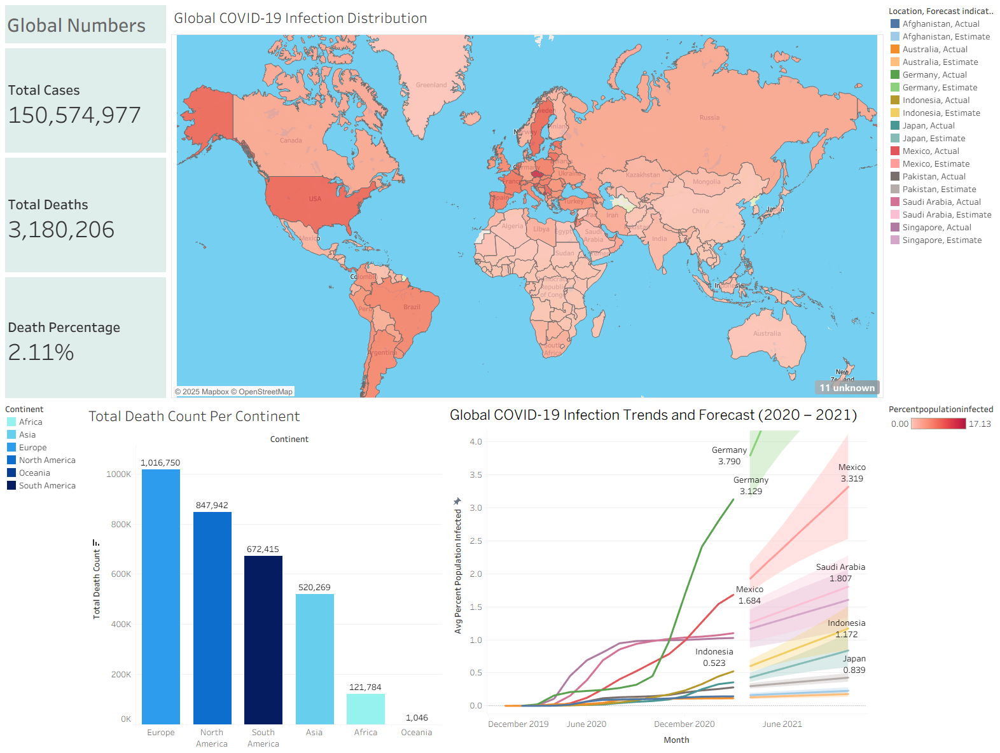

# 🦠 Global COVID-19 Analysis (Tableau Project)

## 📘 Project Overview
This project analyzes the **global impact of COVID-19 (2019–2021)** by exploring confirmed cases, death rates, and infection distribution across continents and countries.  
The goal is to visualize how the virus spread geographically and to identify regions with the highest mortality and infection trends.

The dataset is based on the **COVID-19 Global Data** used in *Alex The Analyst’s Data Analyst Portfolio Project*,  
and all visualizations were built using **Tableau Public**.

---

## 🎯 Objectives
- Visualize the **global infection distribution** using an interactive map  
- Compare **total death counts per continent**  
- Show **infection growth trends** and apply **forecasting (2020–2021)**  
- Calculate **overall global metrics** (cases, deaths, death percentage)  
- Identify which countries experienced the fastest infection increases  

---

## 📊 Dashboard Preview

🔗 **View Interactive Dashboard on Tableau Public:**  
[Global COVID-19 Dashboard – Tableau Project](https://public.tableau.com/app/profile/james.anderson1890/viz/CovidDashboardProject_17613934462080/Dashboard1?publish=yes)

---

## 💾 Dataset Source
📚 **Dataset:** [COVID-19 Data Exploration – Alex The Analyst](https://github.com/AlexTheAnalyst/PortfolioProjects/blob/main/Covid%20Data%20Exploration.sql)  
👤 **Author:** Alexander Freberg (*Alex The Analyst*)  
📄 **License:** Public dataset for educational use  

**Dataset includes:**
- Total cases and deaths by location  
- Infection rate relative to population  
- Date-wise global COVID-19 reporting  
- Forecast and trend-ready time-series data  

---

## 🧠 Key Insights
- 🌍 Over **150 million total cases** were recorded globally during the 2020–2021 period.  
- ⚰️ The global **death count surpassed 3.18 million**, with an average **death rate of 2.11%**.  
- 📈 **Europe and North America** had the highest death counts overall.  
- 📊 **Germany and Mexico** showed strong upward infection trends entering 2021.  
- 🔮 Forecasting suggests continued but slowing growth of infections in mid-2021.  

---

## 💡 Visualization Focus
- **Global Numbers (KPIs)** — Total Cases, Deaths, and Death Percentage  
- **Geographical Map** — Percent population infected by country  
- **Bar Chart** — Total Death Count per Continent  
- **Line Forecast Chart** — Global COVID-19 infection trend (2020–2021)  

---

## 🧰 Tools Used
- **Tableau Public** — Data visualization and forecasting  
- **PostgreSQL** — Data extraction and cleaning via SQL queries  
- **Excel** — Additional preprocessing for visualization compatibility  

---

## 📂 Files in This Folder
| File | Description |
|------|--------------|
| `GlobalCovid19Analysis.png` | Screenshot of the Tableau dashboard |
| `README.md` | Project documentation |

---

## ✍️ Author
**James**  
🎓 Tarumanagara University — Computer Science  
📍 Jakarta, Indonesia  
📊 Data Analysis & Visualization Enthusiast  

---

### 🏷️ Attribution
Dataset: [COVID-19 Data Exploration by Alex The Analyst](https://github.com/AlexTheAnalyst/PortfolioProjects/blob/main/Covid%20Data%20Exploration.sql)  
Visualization: [Global COVID-19 Dashboard – Tableau Public](https://public.tableau.com/app/profile/james.anderson1890/viz/CovidDashboardProject_17613934462080/Dashboard1?publish=yes)
